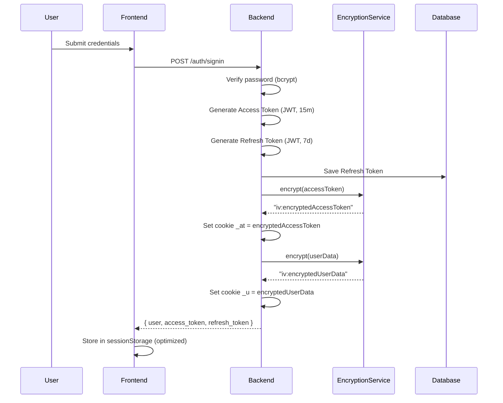
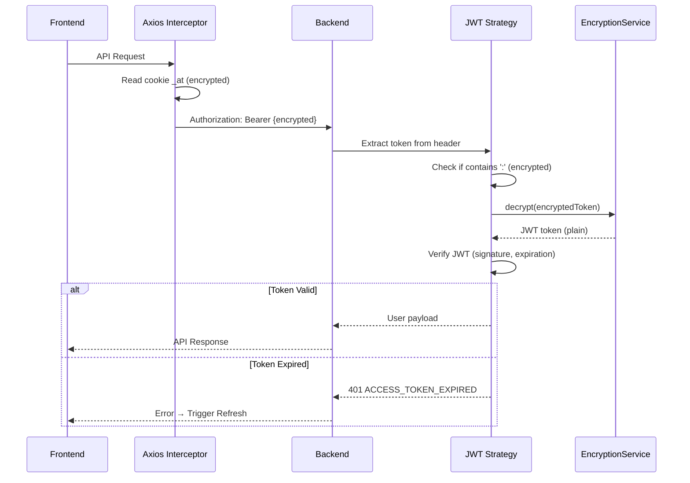
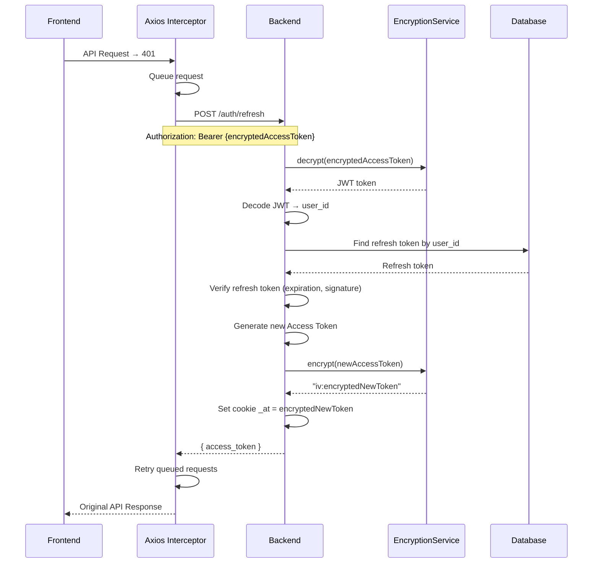

# 🔐 JWT AUTHENTICATION VỚI MÃ HÓA BẢO MẬT - TÀI LIỆU TỔNG HỢP

## Mục lục
1. [Tổng quan](#tổng-quan)
2. [Kiến trúc mã hóa](#kiến-trúc-mã-hóa)
3. [JWT Token Lifecycle với Encryption](#jwt-token-lifecycle-với-encryption)
4. [Luồng hoạt động chi tiết](#luồng-hoạt động-chi-tiết)
5. [Trạng thái sống của Token](#trạng-thái-sống-của-token)
6. [SessionStorage Optimization](#sessionstorage-optimization)
7. [Security Measures](#security-measures)
8. [Error Handling](#error-handling)

---

## Tổng quan

Hệ thống EduLearn sử dụng **JWT Authentication** kết hợp với **AES-256-CBC Encryption** để bảo vệ dữ liệu nhạy cảm:

- **Access Token (JWT)**: Thời gian sống 15 phút, được mã hóa trước khi lưu vào cookie
- **Refresh Token (JWT)**: Thời gian sống 7 ngày, lưu trong database
- **User Data**: Thông tin user được mã hóa và lưu trong cookie `_u`
- **Cookie Names**: Sử dụng tên ngắn gọn, khó đoán (`_at`, `_u`) thay vì tên rõ ràng

### Các thành phần chính:

```
┌─────────────────────────────────────────────────────────────┐
│                    FRONTEND (Next.js)                       │
│  - Cookie Management (encrypted _at, _u)                     │
│  - SessionStorage Cache (optimized)                         │
│  - Axios Interceptors (auto refresh)                       │
│  - useUserId Hook (wait for decryption)                    │
└─────────────────────────────────────────────────────────────┘
                          ↕ HTTP/HTTPS
┌─────────────────────────────────────────────────────────────┐
│                    BACKEND (NestJS)                          │
│  - EncryptionService (AES-256-CBC)                           │
│  - JWT Strategy (decrypt before verify)                     │
│  - AuthService (token generation)                            │
│  - AuthToken Repository (refresh token storage)              │
└─────────────────────────────────────────────────────────────┘
                          ↕
┌─────────────────────────────────────────────────────────────┐
│                    DATABASE (MySQL)                          │
│  - auth_tokens (refresh tokens)                              │
│  - users (user credentials)                                  │
└─────────────────────────────────────────────────────────────┘
```

---

## Kiến trúc mã hóa

### AES-256-CBC Encryption

**Algorithm**: `aes-256-cbc`
- **Key Size**: 32 bytes (256 bits)
- **IV (Initialization Vector)**: 16 bytes (random mỗi lần encrypt)
- **Format**: `iv:encryptedData` (hex encoded)

### Encryption Service

```typescript
// Backend: EncryptionService
encrypt(text: string): string {
  const iv = crypto.randomBytes(16);  // Random IV mỗi lần
  const cipher = crypto.createCipheriv('aes-256-cbc', key, iv);
  let encrypted = cipher.update(text, 'utf8', 'hex');
  encrypted += cipher.final('hex');
  return `${iv.toString('hex')}:${encrypted}`;  // Format: iv:data
}

decrypt(encryptedText: string): string {
  const [ivHex, encrypted] = encryptedText.split(':');
  const iv = Buffer.from(ivHex, 'hex');
  const decipher = crypto.createDecipheriv('aes-256-cbc', key, iv);
  let decrypted = decipher.update(encrypted, 'hex', 'utf8');
  decrypted += decipher.final('utf8');
  return decrypted;
}
```

### Cookie Encryption Flow

```
1. Backend tạo JWT token
   ↓
2. EncryptionService.encrypt(token) → "iv:encryptedData"
   ↓
3. Set cookie: res.cookie('_at', encryptedValue)
   ↓
4. Frontend đọc cookie (encrypted)
   ↓
5. Frontend gửi trong Authorization header (vẫn encrypted)
   ↓
6. Backend JWT Strategy decrypt → JWT token
   ↓
7. Verify JWT signature và expiration
```

---

## JWT Token Lifecycle với Encryption

### 1. Token Generation (Sign In/Sign Up)



### 2. Token Usage (API Request)



### 3. Token Refresh Flow



---

## Luồng hoạt động chi tiết

### Sign In Flow

```
1. User nhập email/username + password
   ↓
2. Frontend: POST /auth/signin
   ↓
3. Backend AuthService:
   - Verify password (bcrypt.compare)
   - Check user status (phải "online")
   - Generate Access Token (JWT, 15m, payload: { sub: user_id, ... })
   - Generate Refresh Token (JWT, 7d, payload: { sub: user_id, ... })
   - Save Refresh Token vào auth_tokens table
   ↓
4. Backend EncryptionService:
   - encrypt(accessToken) → "iv1:encryptedAccessToken"
   - encrypt(JSON.stringify(userData)) → "iv2:encryptedUserData"
   ↓
5. Backend set cookies:
   - Cookie '_at' = encryptedAccessToken (maxAge: 15m)
   - Cookie '_u' = encryptedUserData (maxAge: 7d)
   ↓
6. Frontend nhận response:
   - Lưu vào sessionStorage (optimized)
   - Trigger decrypt async (nếu cần)
   - Redirect đến dashboard
```

### API Request Flow

```
1. Frontend gọi API (ví dụ: GET /api/classes)
   ↓
2. Axios Interceptor (request):
   - Đọc cookie '_at' (encrypted)
   - Set Authorization: Bearer {encryptedValue}
   ↓
3. Backend nhận request:
   - JWT Strategy extract token từ Authorization header
   - Kiểm tra format: có chứa ':' không?
   - Nếu có → decrypt trước khi verify
   - Nếu không → verify trực tiếp (legacy support)
   ↓
4. JWT Strategy verify:
   - Decode JWT (nếu đã decrypt)
   - Verify signature (HMAC SHA256)
   - Check expiration (exp claim)
   ↓
5. Nếu valid:
   - Extract user_id từ payload
   - Attach user vào request
   - Cho phép request tiếp tục
   ↓
6. Nếu expired:
   - Throw UnauthorizedException
   - ErrorFilter catch → { code: "ACCESS_TOKEN_EXPIRED" }
   - Frontend nhận 401 → Trigger refresh
```

### Refresh Token Flow

```
1. Frontend nhận 401 với code "ACCESS_TOKEN_EXPIRED"
   ↓
2. Axios Interceptor (response):
   - Check if isRefreshing = false
   - Set isRefreshing = true
   - Queue failed request
   ↓
3. Frontend: POST /auth/refresh
   - Authorization: Bearer {encryptedAccessToken}
   - Body: { refresh_token }
   ↓
4. Backend AuthController.refresh:
   - Đọc encryptedAccessToken từ Authorization header
   - decrypt(encryptedAccessToken) → JWT token
   - Decode JWT → user_id
   - Tìm refresh token trong database
   - Verify refresh token (expiration, signature)
   ↓
5. Backend generate new Access Token:
   - Generate JWT (15m)
   - encrypt(newAccessToken) → "iv:encryptedNewToken"
   - Set cookie '_at' = encryptedNewToken
   ↓
6. Backend return: { access_token: newAccessToken }
   ↓
7. Frontend:
   - Set isRefreshing = false
   - Retry queued requests với new token
   - Clear auth cache
```

### Sign Out Flow

```
1. Frontend: POST /auth/signout
   ↓
2. Backend AuthController.signout:
   - Đọc encryptedAccessToken từ cookie hoặc header
   - decrypt(encryptedAccessToken) → JWT token
   - Decode JWT → user_id
   - Xóa tất cả refresh tokens của user trong database
   - Clear cookies (_at, _u)
   ↓
3. Frontend:
   - Clear sessionStorage
   - Clear all caches
   - Clear localStorage (giữ theme)
   - Redirect to /auth
```

---

## Trạng thái sống của Token

### Access Token States

| Trạng thái | Mô tả | Phát hiện bởi | Hành động |
|-----------|-------|--------------|-----------|
| **VALID** | Token hợp lệ, chưa hết hạn | Backend (JWT verify) | Cho phép request |
| **EXPIRED** | Token đã hết hạn (exp < now) | Backend (JWT verify) | Trả 401 → Frontend refresh |
| **INVALID** | Token không hợp lệ (signature sai) | Backend (JWT verify) | Trả 401 → Frontend logout |
| **MISSING** | Không có token trong request | Backend (JWT Strategy) | Trả 401 → Frontend redirect /auth |
| **ENCRYPTED** | Token đang ở dạng mã hóa | Frontend/Backend (check ':') | Decrypt trước khi verify |

### Refresh Token States

| Trạng thái | Mô tả | Phát hiện bởi | Hành động |
|-----------|-------|--------------|-----------|
| **VALID** | Token hợp lệ, chưa hết hạn, tồn tại trong DB | Backend (DB lookup + verify) | Generate new access token |
| **EXPIRED** | Token đã hết hạn (exp < now) | Backend (JWT verify) | Trả 401 → Frontend logout |
| **NOT_FOUND** | Token không tồn tại trong DB | Backend (DB lookup) | Trả 401 → Frontend logout |
| **INVALID** | Token không hợp lệ (signature sai) | Backend (JWT verify) | Trả 401 → Frontend logout |

### Token Lifecycle Timeline

```
┌─────────────────────────────────────────────────────────────┐
│                    ACCESS TOKEN LIFECYCLE                   │
└─────────────────────────────────────────────────────────────┘

Sign In
  │
  ├─► Generated (JWT, 15m)
  ├─► Encrypted (AES-256-CBC)
  ├─► Stored in Cookie '_at'
  ├─► Cached in SessionStorage
  │
  ├─► Used in API Requests (encrypted in Authorization header)
  │   ├─► Backend decrypts
  │   ├─► JWT Strategy verifies
  │   └─► Request allowed/denied
  │
  ├─► Expires (after 15m)
  │   └─► 401 ACCESS_TOKEN_EXPIRED
  │       └─► Trigger Refresh
  │
  └─► Refreshed (new token generated)
      └─► Repeat cycle

┌─────────────────────────────────────────────────────────────┐
│                   REFRESH TOKEN LIFECYCLE                   │
└─────────────────────────────────────────────────────────────┘

Sign In
  │
  ├─► Generated (JWT, 7d)
  ├─► Stored in Database (auth_tokens table)
  │   ├─► user_id
  │   ├─► refresh_token
  │   ├─► device_name
  │   ├─► ip_address
  │   └─► refresh_expires_at
  │
  ├─► Used in Refresh Flow
  │   ├─► Backend looks up in DB
  │   ├─► Verifies expiration
  │   └─► Generates new access token
  │
  ├─► Expires (after 7d)
  │   └─► 401 REFRESH_TOKEN_EXPIRED
  │       └─► Frontend logout
  │
  └─► Revoked (on signout)
      └─► Deleted from database
```

### State Transitions

```
VALID → EXPIRED
  - Trigger: Time passes (exp < now)
  - Detection: Backend JWT verify
  - Action: 401 → Frontend refresh

EXPIRED → VALID
  - Trigger: Refresh token flow
  - Detection: Backend generates new token
  - Action: New access token issued

VALID → INVALID
  - Trigger: Token tampered or signature wrong
  - Detection: Backend JWT verify
  - Action: 401 → Frontend logout

MISSING → VALID
  - Trigger: User signs in
  - Detection: Backend generates tokens
  - Action: Tokens set in cookies
```

---

## SessionStorage Optimization

### Cơ chế Cache

**Mục đích**: Tránh gọi API decrypt nhiều lần, cải thiện performance

**Implementation**:

```typescript
// 1. Kiểm tra sessionStorage trước (sync, nhanh nhất)
const sessionUserId = sessionStorage.getItem('edulearn_user_id');
if (sessionUserId) return sessionUserId;

// 2. Nếu không có, decrypt cookie và lưu vào sessionStorage
const encryptedCookie = getCookie('_u');
const response = await fetch('/api-proxy/auth/decrypt-user');
const userData = response.data;
sessionStorage.setItem('edulearn_user_id', userData.user_id);
sessionStorage.setItem('edulearn_user_data', JSON.stringify(userData));
```

### Cache Flow

```
Lần đầu truy cập:
1. Component mount
2. Check sessionStorage → Không có
3. Gọi API decrypt cookie '_u'
4. Lưu vào sessionStorage
5. Return user_id

Các lần sau (trong cùng session):
1. Component mount
2. Check sessionStorage → Có rồi!
3. Return user_id ngay (không cần decrypt)
4. Performance: Tăng tốc đáng kể

Khi đóng trình duyệt:
- SessionStorage tự động xóa
- Lần mở lại sẽ decrypt lại (bảo mật)
```

### Cache Keys

- `edulearn_user_id`: User ID (number/string)
- `edulearn_user_data`: Full user data (JSON string)

### Cache Invalidation

- **On Logout**: Clear sessionStorage
- **On Browser Close**: Auto-clear (sessionStorage behavior)
- **On Token Refresh**: Update cache if user data changes

---

## Security Measures

### 1. Encryption Layer

**AES-256-CBC Encryption**:
- **Key**: 32 bytes (256 bits), lưu trong environment variable
- **IV**: Random 16 bytes mỗi lần encrypt (không reuse)
- **Format**: `iv:encryptedData` (hex encoded)

**Lợi ích**:
- Cookie không thể đọc trực tiếp (phải decrypt)
- Mỗi lần encrypt tạo ra giá trị khác nhau (do IV random)
- Không thể reverse engineering từ cookie value

### 2. Cookie Security

**Cookie Configuration**:
```typescript
{
  httpOnly: false,  // Cần để frontend đọc và decrypt
  secure: process.env.NODE_ENV === 'production',  // HTTPS only in production
  sameSite: 'lax',  // CSRF protection
  maxAge: 15 * 60 * 1000,  // 15 minutes for _at
  path: '/',  // Available to all paths
}
```

**Cookie Names**:
- `_at`: Access Token (encrypted) - Khó đoán
- `_u`: User Data (encrypted) - Khó đoán

### 3. JWT Security

**JWT Structure**:
```
Header: { alg: "HS256", typ: "JWT" }
Payload: { sub: user_id, iat: issued_at, exp: expiration }
Signature: HMAC-SHA256(header + payload, secret)
```

**Security Features**:
- Signature verification (không thể giả mạo)
- Expiration check (tự động hết hạn)
- Secret key lưu trong environment variable

### 4. Token Storage Security

**Backend**:
- Refresh tokens lưu trong database (có thể revoke)
- Access tokens không lưu (stateless JWT)

**Frontend**:
- Cookies (encrypted) - Không thể đọc trực tiếp
- SessionStorage (decrypted user_id) - Tự động xóa khi đóng browser
- Không lưu trong localStorage (trừ theme)

### 5. Request Security

**Authorization Header**:
- Format: `Bearer {encryptedAccessToken}`
- Backend tự động decrypt trước khi verify
- Không expose JWT token trong plain text

**CORS Protection**:
- Chỉ cho phép origins được cấu hình
- Credentials: true (để gửi cookies)

---

## Error Handling

### Error Codes

| Code | HTTP Status | Mô tả | Hành động Frontend |
|------|-------------|-------|-------------------|
| `ACCESS_TOKEN_EXPIRED` | 401 | Access token đã hết hạn | Trigger refresh token flow |
| `INVALID_ACCESS_TOKEN` | 401 | Access token không hợp lệ | Logout và redirect /auth |
| `REFRESH_TOKEN_EXPIRED` | 401 | Refresh token đã hết hạn | Logout và redirect /auth |
| `INVALID_REFRESH_TOKEN` | 401 | Refresh token không hợp lệ | Logout và redirect /auth |
| `REFRESH_TOKEN_NOT_FOUND` | 401 | Refresh token không tồn tại trong DB | Logout và redirect /auth |
| `USER_BANNED` | 401 | User đã bị banned | Logout và redirect /auth |
| `INVALID_CREDENTIALS` | 401 | Email/Password sai | Hiển thị error message |

### Error Response Format

```json
{
  "status": false,
  "code": "ACCESS_TOKEN_EXPIRED",
  "message": "Access token đã hết hạn. Vui lòng refresh token.",
  "data": null,
  "statusCode": 401,
  "timestamp": "2024-01-01T00:00:00.000Z"
}
```

### Frontend Error Handling

```typescript
// Axios Interceptor
apiClient.interceptors.response.use(
  (response) => response,
  async (error) => {
    if (error.response?.status === 401) {
      const code = error.response?.data?.code;
      
      if (code === 'ACCESS_TOKEN_EXPIRED') {
        // Trigger refresh
        return refreshAndRetry(error);
      }
      
      if (code === 'REFRESH_TOKEN_EXPIRED' || 
          code === 'INVALID_REFRESH_TOKEN') {
        // Logout
        await signOut();
        return Promise.reject(error);
      }
    }
    
    return Promise.reject(error);
  }
);
```

---

## Best Practices

### 1. Token Management

✅ **DO**:
- Luôn encrypt token trước khi lưu vào cookie
- Sử dụng sessionStorage để cache (performance)
- Clear cache khi logout
- Verify token expiration trên backend

❌ **DON'T**:
- Không lưu token trong localStorage (trừ theme)
- Không gửi token trong URL
- Không log token trong console (production)
- Không reuse IV khi encrypt

### 2. Security

✅ **DO**:
- Sử dụng HTTPS trong production
- Rotate encryption keys định kỳ
- Validate token signature mỗi request
- Implement rate limiting cho refresh endpoint

❌ **DON'T**:
- Không hardcode encryption key
- Không expose JWT secret
- Không skip expiration check
- Không trust client-side token validation

### 3. Performance

✅ **DO**:
- Cache decrypted user_id trong sessionStorage
- Debounce refresh token calls
- Queue requests khi đang refresh
- Minimize cookie parsing overhead

❌ **DON'T**:
- Không decrypt cookie mỗi request (dùng cache)
- Không gọi refresh nhiều lần cùng lúc
- Không block UI khi decrypt

---

## Implementation Checklist

- [x] EncryptionService với AES-256-CBC
- [x] Cookie encryption cho _at và _u
- [x] JWT Strategy decrypt trước khi verify
- [x] SessionStorage cache optimization
- [x] useUserId hook với async decrypt
- [x] Axios interceptors với auto-refresh
- [x] Error codes system
- [x] Clear cache on logout
- [x] Secure cookie configuration
- [x] CORS với credentials

---

*Tài liệu này tổng hợp từ các file documentation hiện có và được cập nhật với implementation mới nhất.*
